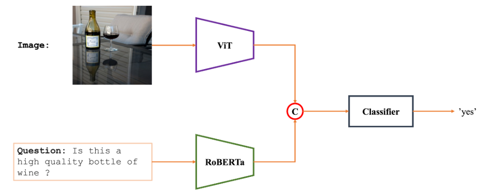

Here is a summary for the README file based on the images you provided:

---

**Visual Question Answering (VQA) using VisionTransformer + RoBERTa**

This project focuses on developing a Visual Question Answering (VQA) system that answers questions about images. The model architecture is based on the integration of **VisionTransformer (ViT)** for image processing and **RoBERTa** for understanding natural language questions.

### Overview

- **VQA** is a task in machine learning that combines **Computer Vision** and **Natural Language Processing**. The goal is to interpret images and respond to questions related to the visual content.

- In this project, the VQA system takes an image and a natural language question as input and provides a text-based answer. For example, given the question "Is this a truck?" and an image, the model should return the answer "yes".

### Model Architecture

The model is divided into three key stages:

1. **Feature Extraction**:  
   The first step involves extracting relevant features from the image using an **Image Encoder** (VisionTransformer). The text question is also processed with a **Question Encoder**.

2. **Feature Fusion**:  
   In this step, the extracted features from both the image and the text question are combined using a fusion technique. This helps to create a unified representation of the information for further analysis.

3. **Answer Generation**:  
   The fused features are passed to a neural network that generates an appropriate answer, typically a classification label (e.g., "yes", "no").

### Advanced Approach: VisionTransformers + RoBERTa

In this project, we take a more advanced approach by combining **VisionTransformer (ViT)** and **RoBERTa**. The ViT is responsible for processing the image, and RoBERTa is used for interpreting the natural language question. Both outputs are fused and passed to a classifier to generate the final answer.

### Pipeline Diagram

- **Input**: An image and a natural language question.
- **Process**:
  - The image is processed by ViT.
  - The question is encoded by RoBERTa.
- Both features are fused and passed to a classifier.
- **Output**: A text-based answer to the question, e.g., "yes".

---
